<p align="center">
  
  
  
  
  
  
</p>

<h1 align="center">EquiLink</h1>

<p align="center">
  <strong>Modular Monolith Order Management System with Event Sourcing, CQRS, Multi-Tenancy, and Pre-Trade Risk Controls</strong>
</p>

<p align="center">
  EquiLink is a production-grade institutional trading platform designed for asset managers, hedge funds, and prop trading firms. It provides a fully auditable, append-only event store for order lifecycle management with real-time pre-trade risk validation, multi-tenant data isolation, and compliance-grade archival.
</p>

---

## Table of Contents

- [Architecture Overview](#architecture-overview)
- [Key Features](#key-features)
- [System Architecture](#system-architecture)
- [Event Flow](#event-flow)
- [Project Structure](#project-structure)
- [Quick Start](#quick-start)
- [API Endpoints](#api-endpoints)
- [Database Schema](#database-schema)
- [Multi-Tenancy](#multi-tenancy)
- [Idempotency](#idempotency)
- [Pre-Trade Risk Engine](#pre-trade-risk-engine)
- [Compliance & Audit](#compliance--audit)
- [Deployment](#deployment)
- [Development](#development)

---

## Architecture Overview

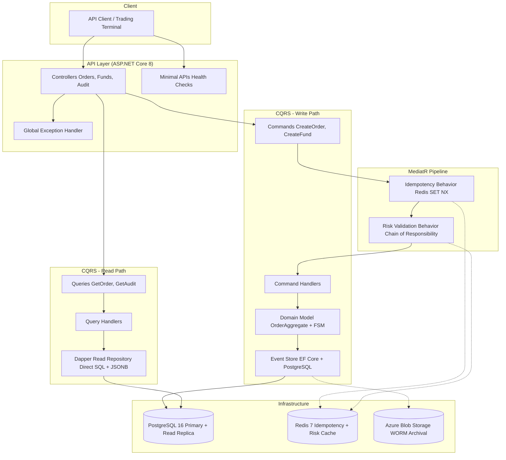

---

## Key Features

| Feature | Description |
|---------|-------------|
| **Event Sourcing** | All order state changes are persisted as immutable domain events in an append-only PostgreSQL table with `REVOKE UPDATE, DELETE` enforcement |
| **CQRS** | Strict separation of write (EF Core → Event Store) and read (Dapper → JSONB extraction) paths |
| **Multi-Tenancy** | Fund-level data isolation via EF Core global query filters with auditable `IgnoreTenantFilter<T>()` override |
| **Idempotency** | Redis-based deduplication using `SET NX` with 24h TTL, scoped per fund to prevent cross-tenant collisions |
| **Pre-Trade Risk Engine** | Chain-of-responsibility pipeline with pluggable risk rules (symbol blacklist, max order size) evaluated against Redis-cached state |
| **Multi-Asset Support** | Equities, ETFs, and Futures with asset-specific tick rules, margin calculations, and regulatory compliance |
| **Regulatory Amendments** | `OrderCorrectedEvent` for compensating corrections — errors are appended, never mutated |
| **Compliance Audit** | `GET /audit/orders` endpoint with CSV/PDF export and SHA-256 signing |
| **WORM Archival** | Monthly partition archival to Azure Blob Storage with immutable blob policy for 7-year retention |
| **Read Replica Routing** | `IConnectionStringProvider` routes all Dapper queries to PostgreSQL read replicas, EF Core writes go exclusively to primary |
| **Fund Onboarding** | `POST /funds` with risk limit templating (MaxOrderSize, DailyLossLimit, ConcentrationLimit) |

---

## System Architecture

### Request Pipeline

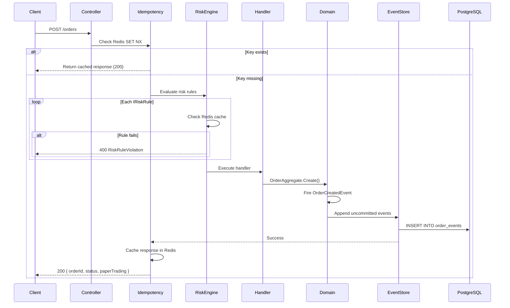

### Read Path

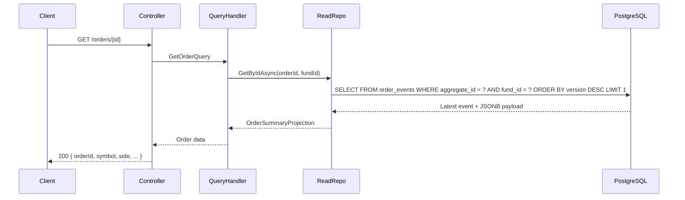

---

## Event Flow

### Order Lifecycle State Machine

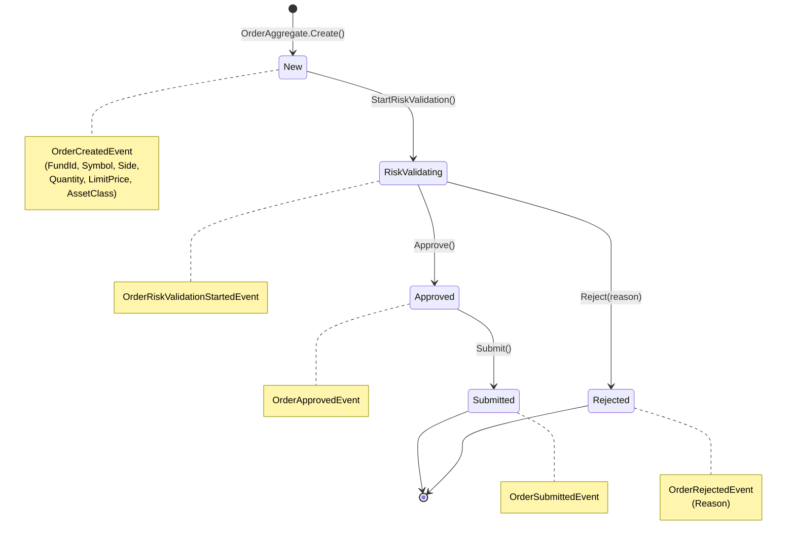

### Regulatory Correction Flow

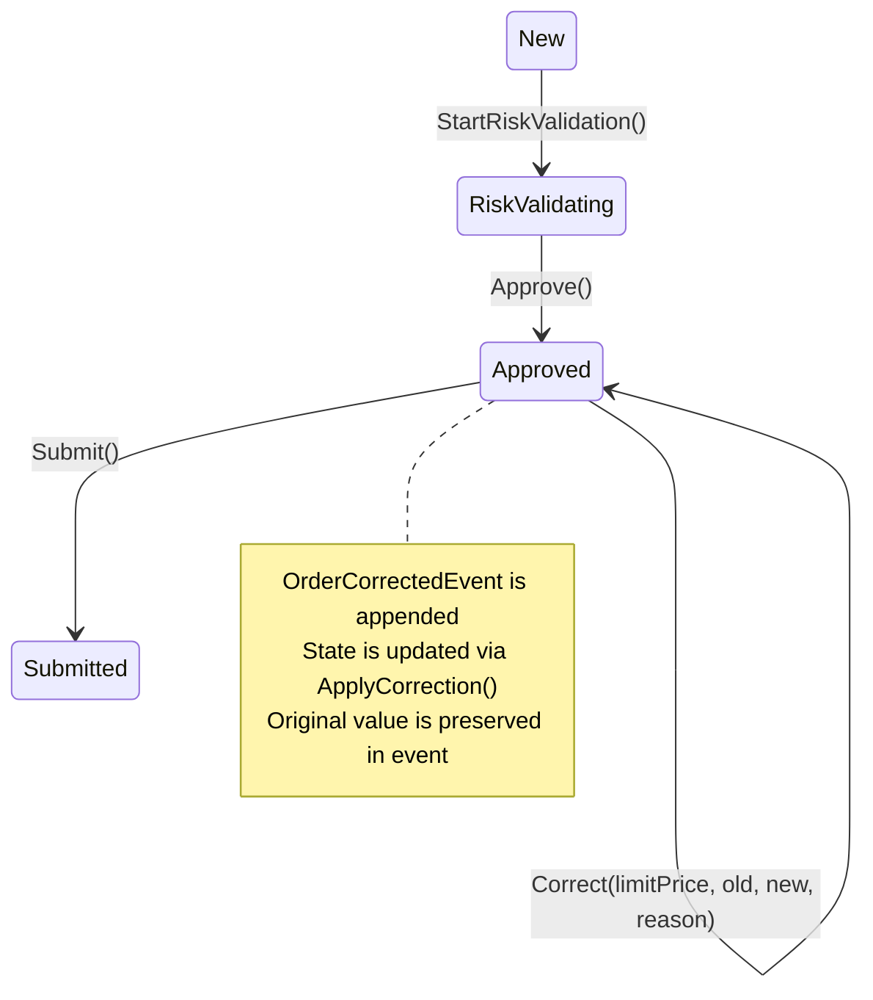

---

## Project Structure

```
EquiLink/
├── src/
│   ├── Domain/                    # Core domain (no external dependencies)
│   │   ├── Aggregates/
│   │   │   ├── Order/
│   │   │   │   ├── Events/        # Domain events (OrderCreatedEvent, etc.)
│   │   │   │   ├── AssetClasses/  # AssetClassConfiguration
│   │   │   │   ├── TickRules/     # ITickRule + implementations
│   │   │   │   ├── Margin/        # IMarginCalculator + implementations
│   │   │   │   └── OrderAggregate.cs
│   │   │   └── Fund/
│   │   │       ├── Fund.cs
│   │   │       ├── FundRiskLimits.cs
│   │   │       └── FundRiskLimitTemplate.cs
│   │   ├── EventStore/
│   │   │   └── IEventStore.cs
│   │   └── Events/
│   │       ├── IDomainEvent.cs
│   │       └── DomainEvent.cs
│   │
│   ├── Infrastructure/            # EF Core, Redis, external services
│   │   ├── Behaviors/
│   │   │   └── IdempotencyBehavior.cs
│   │   ├── Compliance/
│   │   │   ├── Export/            # CsvExportService, PdfExportService
│   │   │   ├── ComplianceAuditService.cs
│   │   │   └── WormArchivalService.cs
│   │   ├── DataTier/
│   │   │   └── ConnectionStringProvider.cs
│   │   ├── Migrations/            # EF Core migrations
│   │   ├── Persistence/
│   │   │   ├── EventStore/        # OrderEvent entity, EventStore impl
│   │   │   ├── Funds/             # Fund EF configurations
│   │   │   ├── Configurations/
│   │   │   └── EquiLinkDbContext.cs
│   │   ├── ReadModels/
│   │   │   └── OrderSummaryProjection.cs
│   │   ├── ReadRepositories/
│   │   │   └── OrderReadRepository.cs
│   │   ├── RiskEngine/
│   │   │   ├── SymbolBlacklistRule.cs
│   │   │   ├── MaxOrderSizeRule.cs
│   │   │   ├── RedisRiskStateCache.cs
│   │   │   └── RiskValidationBehavior.cs
│   │   └── Tenancy/
│   │       └── CurrentFundContext.cs
│   │
│   ├── Shared/                    # Shared kernel (cross-cutting types)
│   │   ├── AssetClasses/
│   │   │   └── AssetClass.cs
│   │   ├── Idempotency/
│   │   │   └── IdempotencyKeyAttribute.cs
│   │   └── Risk/
│   │       ├── IRiskRule.cs
│   │       ├── IRiskStateCache.cs
│   │       ├── IOrderRequest.cs
│   │       └── RiskRuleResult.cs
│   │
│   └── Api/                       # Entry point
│       ├── Controllers/
│       │   ├── OrdersController.cs
│       │   ├── FundsController.cs
│       │   └── AuditController.cs
│       ├── Endpoints/
│       │   └── HealthCheckEndpoints.cs
│       ├── Features/
│       │   ├── Orders/
│       │   │   ├── Commands/
│       │   │   ├── Queries/
│       │   │   └── Dtos/
│       │   ├── Funds/
│       │   │   ├── Commands/
│       │   │   └── Dtos/
│       │   └── Audit/
│       ├── Middleware/
│       │   └── GlobalExceptionHandler.cs
│       ├── Program.cs
│       └── appsettings.json
│
├── docker-compose.yml
├── Dockerfile
├── .gitignore
├── .dockerignore
├── PROGRESS.md
└── EquiLink.sln
```

---

## Quick Start

### Prerequisites

- Docker & Docker Compose
- .NET 8 SDK (for local development)

### One-Command Deployment

```bash
docker compose up -d
```

This starts:
- **PostgreSQL 16** on port `5432`
- **Redis 7** on port `6379`
- **EquiLink API** on port `8080`

### Verify Deployment

```bash
curl http://localhost:8080/health
# {"status":"Healthy","timestamp":"..."}
```

### Apply Database Migrations

```bash
dotnet ef database update \
  --project src/Infrastructure/Infrastructure.csproj \
  --startup-project src/Api/Api.csproj
```

---

## API Endpoints

### Orders

| Method | Endpoint | Description | Auth |
|--------|----------|-------------|------|
| `POST` | `/api/orders` | Create a new order (paper trading) | JWT `fund_id` claim |
| `GET` | `/api/orders/{id}` | Get order details (Dapper read) | JWT `fund_id` claim |

**Create Order Request:**
```json
{
  "symbol": "AAPL",
  "side": "Buy",
  "quantity": 100,
  "limitPrice": 150.00,
  "assetClass": "Equity"
}
```

**Headers:**
| Header | Required | Description |
|--------|----------|-------------|
| `X-Idempotency-Key` | Yes | UUID v4 for deduplication |
| `Authorization` | Yes | Bearer token with `fund_id` claim |

**Response:**
```json
{
  "orderId": "5131a0e0-49a5-4627-b701-afa3c84deef6",
  "status": "New",
  "paperTrading": true
}
```

### Funds

| Method | Endpoint | Description | Auth |
|--------|----------|-------------|------|
| `POST` | `/api/funds` | Onboard a new fund with risk limits | Admin |
| `GET` | `/api/funds/{id}` | Get fund details | Admin |

**Create Fund Request:**
```json
{
  "name": "Alpha Fund",
  "managerName": "John Doe",
  "riskLimitTemplateName": "Conservative",
  "maxOrderSize": 10000,
  "dailyLossLimit": 50000,
  "concentrationLimit": 0.25
}
```

### Audit

| Method | Endpoint | Description | Auth |
|--------|----------|-------------|------|
| `GET` | `/audit/orders?from=&to=&format=` | Compliance export (CSV/PDF) | Compliance Officer |

**Parameters:**
| Parameter | Required | Description |
|-----------|----------|-------------|
| `from` | Yes | Start date (ISO 8601) |
| `to` | Yes | End date (ISO 8601) |
| `format` | No | `csv` (default) or `pdf` |

### Health

| Method | Endpoint | Description |
|--------|----------|-------------|
| `GET` | `/health` | Health check |

---

## Database Schema

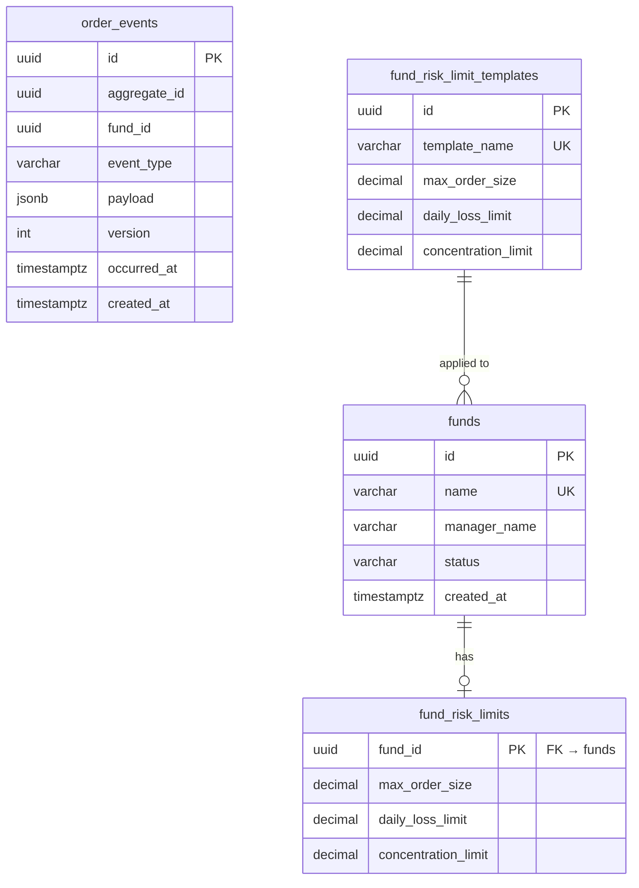

### Append-Only Enforcement

```sql
REVOKE UPDATE, DELETE ON TABLE order_events FROM PUBLIC;
REVOKE UPDATE, DELETE ON TABLE order_events FROM postgres;
```

Only `INSERT` (append) and `SELECT` (read) are permitted. Modifying this requires a superuser migration.

---

## Multi-Tenancy

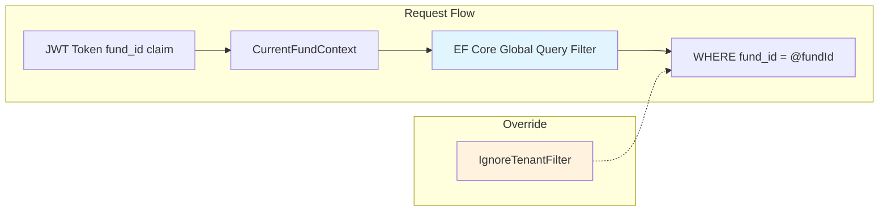

- **Automatic**: Every EF Core query on `OrderEvents` automatically includes `WHERE fund_id = @fundId`
- **Override**: `IgnoreTenantFilter<T>()` provides an auditable bypass for cross-tenant queries (e.g., event stream rehydration by aggregate ID)
- **Extraction**: `CurrentFundContext` reads the `fund_id` claim from the JWT at the start of each request

---

## Idempotency

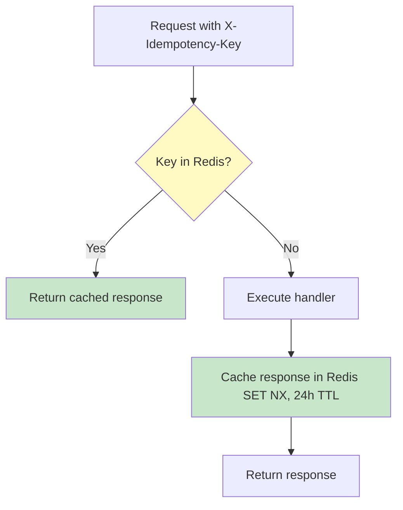

- **Key extraction**: `X-Idempotency-Key` header (UUID v4)
- **Tenant scoping**: Redis key format `idempotency:{fundId}:{idempotencyKey}`
- **Atomic operation**: `SET NX` (set if not exists) prevents race conditions
- **TTL**: 24 hours (configurable via `[IdempotencyKey(ttlHours)]`)
- **Retry behavior**: Returns cached HTTP 200 with original `orderId`, not 409

---

## Pre-Trade Risk Engine

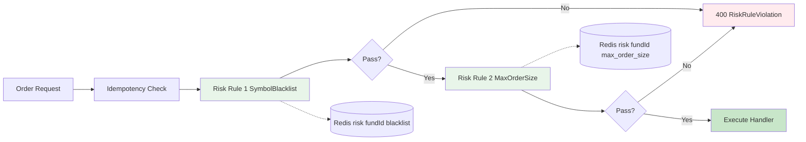

### Risk Rules

| Rule | Order | Redis Key | Logic |
|------|-------|-----------|-------|
| `SymbolBlacklistRule` | 1 | `risk:{fundId}:blacklist` | Rejects if symbol is in the fund's blacklist |
| `MaxOrderSizeRule` | 2 | `risk:{fundId}:max_order_size` | Rejects if quantity exceeds max order size |

### Redis Key Convention

| Key | Type | Description |
|-----|------|-------------|
| `risk:{fundId}:blacklist` | JSON array | Blacklisted symbols |
| `risk:{fundId}:max_order_size` | Decimal string | Maximum order quantity |
| `risk:{fundId}:current_exposure` | Decimal string | Current portfolio exposure |
| `idempotency:{fundId}:{key}` | JSON object | Cached idempotent response |

---

## Compliance & Audit

### Export Flow

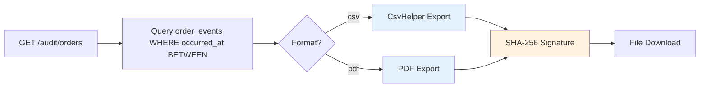

### WORM Archival

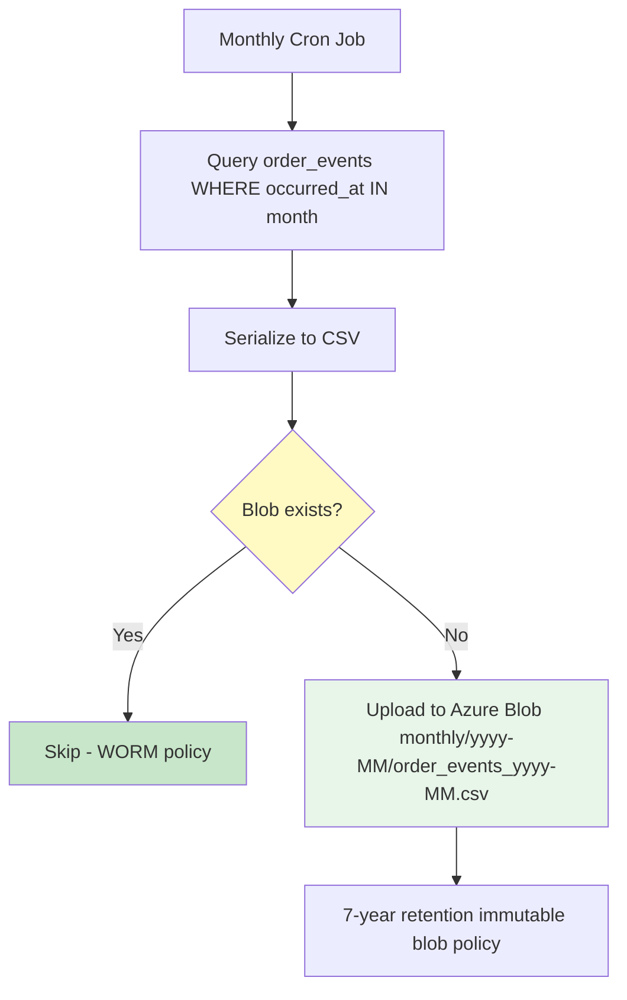

---

## Deployment

### Docker Compose

```yaml
services:
  postgres:
    image: postgres:16-alpine
    ports: ["5432:5432"]
    volumes: [postgres_data:/var/lib/postgresql/data]

  redis:
    image: redis:7-alpine
    ports: ["6379:6379"]
    volumes: [redis_data:/data]

  api:
    build:
      context: .
      dockerfile: Dockerfile
    environment:
      - EQUILINK_ROLE=api
      - ConnectionStrings__Postgres=Host=postgres;Port=5432;...
      - ConnectionStrings__Redis=redis:6379
    ports: ["8080:8080"]
    depends_on:
      postgres: { condition: service_healthy }
      redis: { condition: service_healthy }
```

### Environment Variables

| Variable | Required | Description |
|----------|----------|-------------|
| `EQUILINK_ROLE` | Yes | `api`, `consumer`, or `migrations` |
| `ConnectionStrings__Postgres` | Yes | Primary PostgreSQL connection |
| `ConnectionStrings__PostgresReadOnly` | No | Read replica (falls back to primary) |
| `ConnectionStrings__Redis` | Yes | Redis connection |
| `AzureBlob__ConnectionString` | No | Azure Blob for WORM archival |
| `ASPNETCORE_ENVIRONMENT` | No | `Development` or `Production` |

### Multi-Region Read Replicas

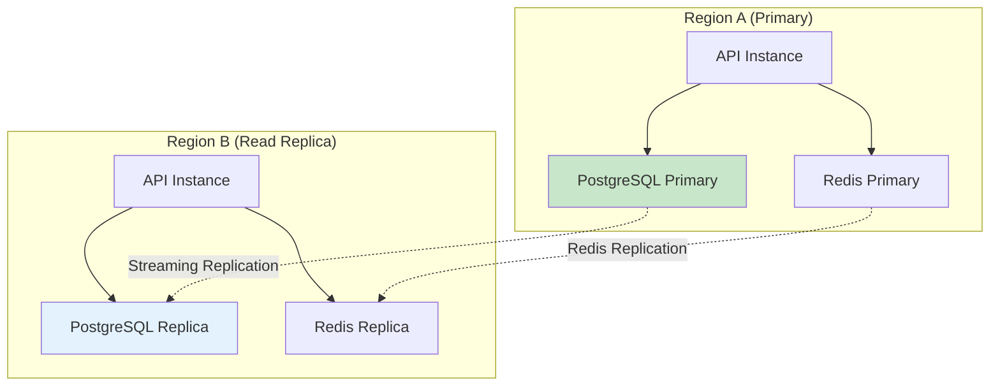

- **Writes**: EF Core `EquiLinkDbContext` → Primary only
- **Reads**: Dapper `OrderReadRepository`, `ComplianceAuditService`, `WormArchivalService` → Replica (via `IConnectionStringProvider`)
- **Fallback**: If `PostgresReadOnly` is not configured, reads fall back to primary with a warning log

---

## Development

### Local Setup

```bash
# Clone repository
git clone https://github.com/DynamicKarabo/equilink.git
cd equilink

# Start infrastructure
docker compose up -d postgres redis

# Apply migrations
dotnet ef database update \
  --project src/Infrastructure/Infrastructure.csproj \
  --startup-project src/Api/Api.csproj

# Run API
dotnet run --project src/Api/Api.csproj
```

### Build

```bash
dotnet build EquiLink.sln
```

### Run Tests

```bash
dotnet test EquiLink.sln
```

### Docker Build

```bash
docker build -t equilink:latest .
docker run -p 8080:8080 \
  -e EQUILINK_ROLE=api \
  -e ConnectionStrings__Postgres="Host=localhost;Port=5432;Database=equilink;Username=postgres;Password=postgres" \
  -e ConnectionStrings__Redis="localhost:6379" \
  equilink:latest
```

---

## License

MIT License — see [LICENSE](LICENSE) for details.
